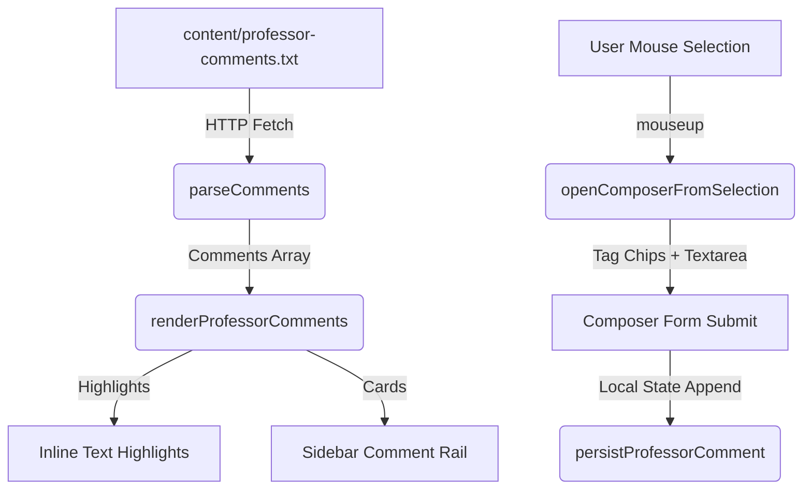

# Portfolio Comment System Architecture

This document explains the technical implementation, data structure, parsing rules, and interface mechanics of the peer/professor commenting system.

---

## 1. High-Level Concept

The commenting system is a lightweight, serverless annotations engine. It loads comments from a flat text file (`content/professor-comments.txt`), highlights the commented lines in the text body dynamically, and displays matching cards in a sidebar (comment rail). When in **Professor Mode**, it also allows users to highlight text using their cursor to open a composer and save new comments.



---

## 2. Data Structure & Parser Grammar

Comments are stored as flat text in `content/professor-comments.txt` using a natural language format:

```text
In "[Essay/Page Title]" at the part "[Exact Text Highlight]" professor said that "[Tag/Category] Comment text details"
```

### Parsing Mechanism
When comments are loaded, the script splits the file by lines and runs each line against a Regular Expression:

```javascript
const match = line.match(/^In "(.*?)" at the part "(.*?)" professor said that "(.*?)"$/);
```

If the expression matches, it returns:
- **`essay` (Capture Group 1)**: Matches the title of the container (e.g. `"Essay 1 First Draft"`).
- **`quote` (Capture Group 2)**: The exact text snippet that was commented on.
- **`text` (Capture Group 3)**: The comment text. If a tag chip was selected, it is prepended in brackets (e.g. `"[Strong point] Nice revision here"`).

### Helper Subroutines
- `commentTag(comment)`: Extracts brackets `[...]` tags if present.
- `commentBody(comment)`: Strips bracket tags from the front of the comment body for rendering.
- `formatFeedbackText(tag, note)`: Combines a tag (like `"Strong point"`) and raw input note into the formatted output line.

---

## 3. Frontend Interactive Flows

### A. Display & Highlighting (`renderProfessorComments`)
1. **Dynamic Highlighting**: The script loops over all elements with the `.md-content` class.
2. It filters out comments that belong to the active text container (`data-title` or `data-file`).
3. For each comment, it checks if the exact `quote` (the text highlighted by the professor) exists in the container's HTML.
4. If a match is found, it wraps the quote in a highlight span:
   ```html
   <span class="comment-highlight" data-comment-id="comment-123">Matched Text</span>
   ```
5. **Rail Alignment**: The rail (`#comment-rail`) builds matching card elements pointing back to the highlights.

### B. Highlighting to Comment (Creating Comments)
1. **Trigger**: When text is selected by clicking and dragging inside any `.md-content` area, a `mouseup` listener fires `openComposerFromSelection()`.
2. **Validation**: The script checks if:
   - Professor Mode is active (`state.professorMode === true`).
   - The user selected at least 3 characters.
   - The selection is nested inside a `.md-content` wrapper.
3. **Population**: The composer (`#comment-composer`) becomes visible (`.active` class is added) and:
   - Displays the selected quote in a blockquote.
   - Resets the selected category tag and focuses the text input field.
4. **Saving**: Submitting the form pushes the new comment onto `state.comments`, updates the highlights, and displays a success toast.

---

## 4. CSS Classes & Design Tokens

- **`.comment-rail`**: Standard absolute-positioned sidebar layout.
- **`.comment-card`**: Elegant translucent glassmorphic cards inside the rail, displaying the author, tag badge, quote, and commentary.
- **`.comment-highlight`**: Custom inline text decoration (such as dynamic red/orange underlines) indicating an annotated quote.
- **`.comment-composer`**: Floats in the viewport when text is selected, featuring tags (`.tag-chip`) and a text area.
- **`.tag-chip.active`**: Changes color/border to reflect the active selection category.
